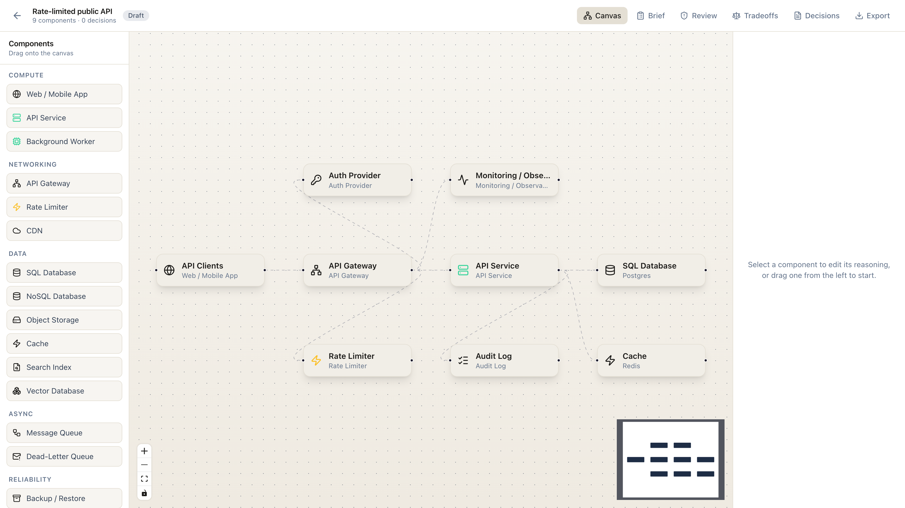

# System Atlas X

**Live demo: [system-atlas-x.vercel.app](https://system-atlas-x.vercel.app)**

**Learn system design. Build real architectures. Get senior-level review.**
Architecture intelligence for engineers, in two modes that share one deterministic
engine: a **Learn Mode** for studying system design and prepping for interviews, and a
**Build Mode** for planning real software architectures. No LLM key required for the core
product; everything is local-first and runs in your browser.



## What it is

System Atlas X is not a diagramming tool. The advantage is not drawing perfect boxes - it
is helping you **think, defend, and improve architecture decisions**. One shared engine
reviews any architecture for missing pieces, explains tradeoffs and failure modes, scores
it, and turns it into either an interview-ready explanation or a production architecture
spec.

- **Learn Mode** - practice system design scenarios, study the building blocks, and
  generate interview-ready explanations, with senior-level review of every design.
- **Build Mode** - plan a real architecture from a guided brief or template, review it for
  production risk, and export an implementation-ready spec.

## Learn Mode

A study and interview-prep path built around 10 scenarios (URL shortener, real-time chat,
video streaming, ride-sharing dispatch, payment processing, notification service, file
upload, distributed rate limiter, e-commerce checkout, form analytics / intake dashboard).

For a chosen scenario you:

1. See the functional and non-functional requirements, concepts, and common pitfalls.
2. Assemble an architecture answer from a searchable component palette.
3. Get a live **Interview Readiness** score (0-49 Needs Work · 50-69 Developing · 70-84
   Strong · 85-100 Interview Ready) with category bars and findings - each marked
   critical / warning / suggestion / strength, with *why it matters* and an interview tip.
4. Compare against a **Senior-Level Reference** architecture (with a missing-piece diff).
5. **Generate an Interview Explanation** - a deterministic, first-person walkthrough of
   requirements, request flow, scaling, reliability, security, observability, and
   tradeoffs (copy as Markdown).
6. Get quiet, contextual nudges from **Atlas Coach**.

Plus 10 lightweight **Study Path** concept modules (request flow, caching, queues/DLQs,
auth, payments & idempotency, observability, interview framing, ...).

## Build Mode

The real-world planning workspace. Start from a template or a structured brief, get a
recommended starter architecture, refine it on a drag-and-drop canvas where every node
carries reasoning, then:

- **Architecture Review** flags the pieces teams most often forget.
- **Tradeoff Engine** recommends which technology to pick, explains why, and swaps a
  component for an alternative in one click.
- **Decision records (ADRs)** capture choices, generated from a recommendation.
- **Export** to JSON (round-trips), a Markdown design doc, or a PNG of the canvas.
- **AI assist (free, optional)** - upload a wireframe and let Google Gemini review the
  design into the Review and Tradeoffs tabs. Bring your own free Gemini key
  ([get one](https://aistudio.google.com/app/apikey)); it is stored only in your browser
  and called directly, so there is still no backend.

## The shared intelligence engine

Both modes run on the same pure, deterministic core (no AI, no API key):

- **43-component catalog** with a deep knowledge layer: purpose, when to use,
  alternatives, tradeoffs, failure modes, interview talking points, implementation notes,
  related components, and tags.
- **Review engine** - a rules-based reviewer (rate limiter on a public API, queue without
  a dead-letter queue, payments without idempotency / audit log / webhook handler,
  admin dashboard without auth, sensitive data without secrets management, ...).
- **Scoring engine** - per-category and overall scores with mode-specific labels
  (Interview Readiness vs Architecture Confidence).
- **Explanation generator** - turns a design into an interview explanation or, in Build
  Mode, an architecture spec.
- **Atlas Coach** - 1-3 calm, senior-engineer tips based on mode, scenario, selection, and
  review results. No popups, no noise.

Because it is deterministic, the engine is testable and instant - the same input always
produces the same review, score, and explanation.

## Tech stack

- Next.js 15 (App Router) + React 19 + TypeScript
- Tailwind CSS (light, premium-minimal theme)
- [React Flow](https://reactflow.dev/) (`@xyflow/react`) for the Build canvas
- Zustand (with `persist`) for state - **local-first, stored in the browser**
- `html-to-image` for PNG export, `lucide-react` for icons
- Google **Gemini** for the optional Build-Mode AI assistant (bring-your-own free key,
  called directly from the browser - no server proxy)

Project and scenario data live in `localStorage` - the app is fully usable with **no
backend, database, or auth**. The only optional layer is the Build-Mode AI assistant.

## Local development

```bash
npm install
npm run dev      # http://localhost:3000
npm run build    # production build / type check
npm test         # vitest (pure engine tests)
```

Routes: `/` (landing) · `/learn` · `/learn/[id]` (scenario workspace) · `/build`
(dashboard) · `/project/[id]` (Build workspace) · `/components` (Component Library).

## Deploy

Stock Next.js App Router app. It deploys to **Vercel** with default settings and **no
environment variables** (local-first persistence). The Gemini key is supplied per-user in
the browser, so it is never an environment variable.

## Roadmap

- Wire Build Mode fully onto the shared engine (Architecture Confidence review + a
  13-section architecture-spec generator)
- More scenarios and reference architectures
- Accounts, a database, and shareable links so work syncs across devices and teams
- Real-time collaboration and version history

## Project structure

```
src/
  app/                 # routes: / (landing), /learn, /learn/[id], /build, /project/[id], /components
  components/
    nav/ coach/        # TopNav, Atlas Coach
    architecture/      # palette, selected board, knowledge panel, review panel (shared)
    learn/             # reference + interview-explanation panels
    brief/ canvas/ review/ tradeoffs/ decisions/ export/ ai/ ui/   # Build Mode
  data/
    learningScenarios.ts       # 10 interview scenarios
    referenceArchitectures.ts  # senior reference answers
    courseModules.ts           # study-path concept modules
  lib/
    catalog.ts          # 43-component library (drives palette + inspector)
    knowledge.ts        # deep study knowledge layer
    reviewEngine.ts     # rules-based review + scoring (pure)
    explanationGenerator.ts  # interview explanation / spec (pure)
    atlasCoach.ts       # contextual coach tips (pure)
    learnTypes.ts learnStore.ts   # Learn Mode types + persisted selections
    types.ts store.ts analysis.ts skeleton.ts linter.ts tradeoffs.ts decisionRules.ts  # Build Mode
    ai/ export/         # gemini client; markdown / png / json exporters
```

See [docs/PRODUCT_PLAN.md](docs/PRODUCT_PLAN.md) for the original product vision.

---

Built by [Abhi Tiwari](https://abhitiwari.dev), with Claude (Anthropic) as a contributor.
